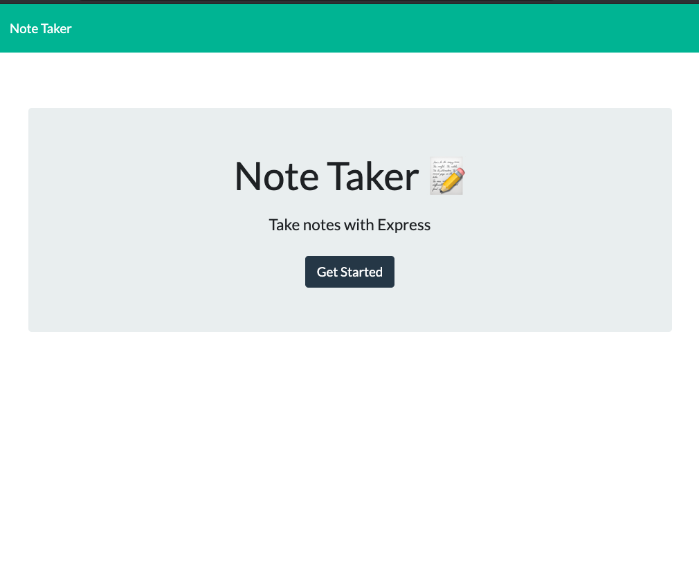
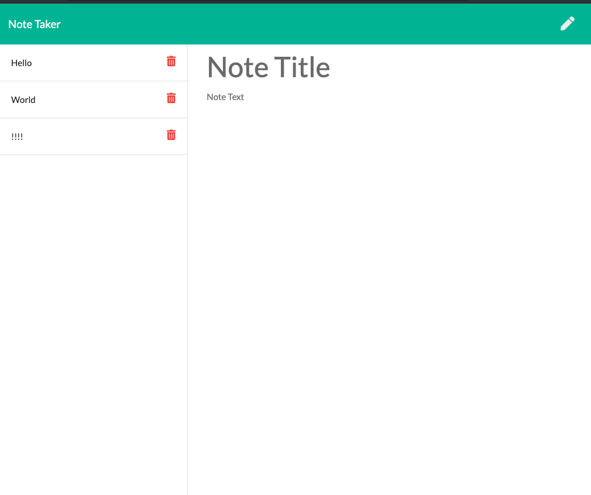

# gt-hw-node-express-note-taker
## Description 

This is a homework requirement for GT Full Stack Flex Program. This node express is designed to create notes that you add on the page, delete, or appear when you click on a specific note. By creating the front end and back end of the website, this is a full stack code.

## Table of Contents

* [Installation](#installation)
* [Usage](#usage)
* [Credits](#credits)
* [MIT License](#mit_license)
* [Badges](#badges)
* [Contributing](#contributing)
* [Tests](#tests)

## Installation

* Open the github pages to see the code
* Open the heroku page

[Link to Github Repo](https://github.com/CrystalWatkins/gt-hw-node-express-note-taker)
 
[Link to Heroku Website](https://stark-cove-69452.herokuapp.com/notes)

## Usage 

This Javascript file uses best practices for Node Express.

[Link to Github Repo](https://github.com/CrystalWatkins/gt-hw-node-express-note-taker).
 
[Link to Heroku Website](https://stark-cove-69452.herokuapp.com/notes).

## Credits

This was a notes app created using node express completed as a homework for the Georgia Tech, FullStack Flex Program.

## MIT_License

Copyright (c) [2020] [Crystal Watkins]

Permission is hereby granted, free of charge, to any person obtaining a copy
of this software and associated documentation files (the "Software"), to deal
in the Software without restriction, including without limitation the rights
to use, copy, modify, merge, publish, distribute, sublicense, and/or sell
copies of the Software, and to permit persons to whom the Software is
furnished to do so, subject to the following conditions:

The above copyright notice and this permission notice shall be included in all
copies or substantial portions of the Software.

THE SOFTWARE IS PROVIDED "AS IS", WITHOUT WARRANTY OF ANY KIND, EXPRESS OR
IMPLIED, INCLUDING BUT NOT LIMITED TO THE WARRANTIES OF MERCHANTABILITY,
FITNESS FOR A PARTICULAR PURPOSE AND NONINFRINGEMENT. IN NO EVENT SHALL THE
AUTHORS OR COPYRIGHT HOLDERS BE LIABLE FOR ANY CLAIM, DAMAGES OR OTHER
LIABILITY, WHETHER IN AN ACTION OF CONTRACT, TORT OR OTHERWISE, ARISING FROM,
OUT OF OR IN CONNECTION WITH THE SOFTWARE OR THE USE OR OTHER DEALINGS IN THE
SOFTWARE.

## Badges

## Contributing

Not currently taking any additional contributions at this time.

## Tests

There are no tests for this code.

